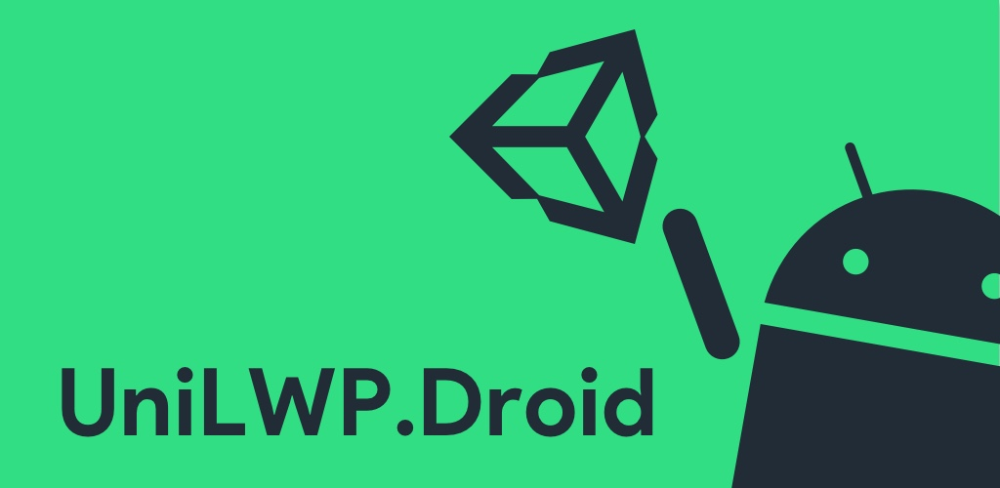
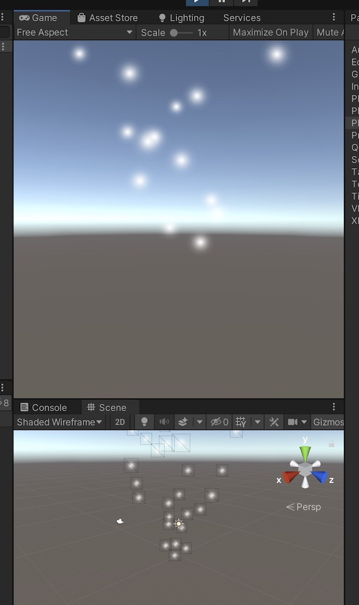
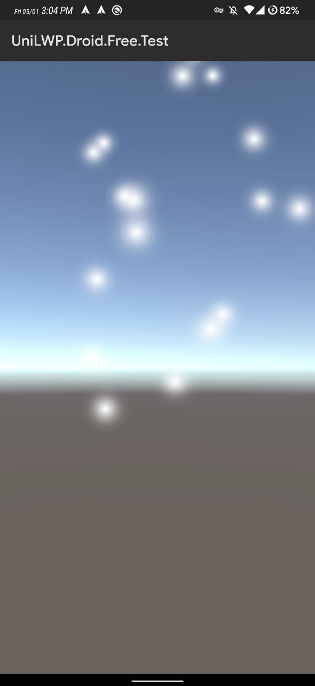
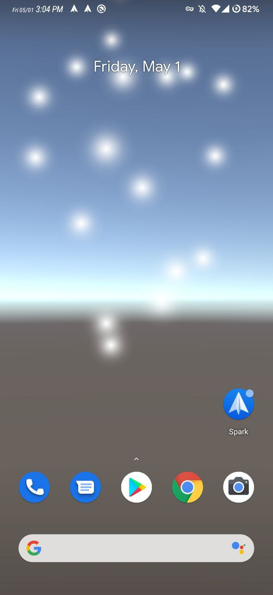

# UniLWP.Droid (Free Version) UPM Package
[](https://openupm.com/packages/com.justzht.unilwp.droid.free/)



UniLWP.Droid is an Android live wallpaper framework for Unity. With it, you can create Android Studio projects that compile to live wallpaper apps. This is the free version of it (full version on: [Asset Store](http://u3d.as/1QVw)), which only contains necessary code for live wallpaper service itself.  
For packaging purposes, the plugin is uploaded as an aar file. The java source can be found on the [JavaSource](https://github.com/JustinFincher/UniLWP.Droid.Free.JavaSource) repo.

# Screenshots
| Editor             | Activity             |  Service |
:-------------------------:|:-------------------------:|:-------------------------:
  |   |  

# Requirements

- Unity 2019.3+ 
- Android API: 7.0 and up
- Works best with OpenGL ES 3.0 (Vulkan is fine, but not that good)

# Installation Guide

- Add this line to your package.json
```
"dependencies": {
    "com.justzht.unilwp.droid.free": "https://github.com/JustinFincher/UniLWP.Droid.Package.Free.git" // this line
}
```
- If you are not in Android target, switch to Android target now
- Modify your build settings
  - Android API to 7.0 and up
  - Disable the Optimized Frame Pacing option
  - Disable Unity Audio (Optional)
  - Graphics API to OpenGL ES 3.0 (Optional)
- Build an apk and install it to your Android device
- Now you have one activity on your launcher, and one service if you open the live wallpaper picker

# How does UniLWP.Droid work?
This section has a more detailed version on [UniLWP.Droid Documentation](https://docs.google.com/document/d/10b5zDYjr2MDDKUhuUeq192YYoOb5YHcEqfLbr_5m9iM/edit?usp=sharing), check it out if you want to know more.  
The UnityPlayer java class has a constructor that accepts a Context instance to init the player itself. It also has a method for switching surfaces:
```java
class UnityPlayer
{
    public UnityPlayer(Context var1) {}
    public boolean displayChanged(int var1, Surface var2) {}
}
```
As UnityPlayer does not enforce the activity check (it actually did for `runOnUiThread` reasons, but that is another story), we can pass an application context to the parameter and init a UnityPlayer.   
This should be executed as soon as possible, so UniLWP.Droid introduced a ContentProvider subclass solely for early-init purposes. 
> For why ContentProvider is even inited earlier than the `onCreate` call in the Application class, please read a post on [firebase blog](http://firebase.googleblog.com/2016/12/how-does-firebase-initialize-on-android.html).   

Our ContentProvider subclass provides a universal application context that calls Unity at the beginning of the application lifecycle, so any Activity or Service inited after that are free of null reference exceptions.  
> Each Activity or WallpaperService references a Surface. On Activity, it is a SurfaceView, and on WallpaperService, it is a SurfaceHolder. UniLWP.Droid registers the callback of these surfaces and call `displayChanged` when a new surface is visible. This is how UniLWP.Droid switch the display target dynamically.  

However, Unity's default activity implementation isn't designed for such usages. In order to bypass this, UniLWP provides an Activity class that replaces the default Activity in gradle compiling stages. The magic is in the merging process of AndroidManifest.xml files. For more you can read [how to remove activity from manifest](https://developer.android.com/studio/build/manifest-merge).

# Feature Comparsion
This is the free & open-sourced version of UniLWP.Droid, and certain features are missing in order for you to buy the full version (obviously). For a comparsion between this free version and a [paid version](http://u3d.as/1QVw), see the table below:

| UniLWP.Droid                          | Free                                                | Paid |
|---------------------------------------|-----------------------------------------------------|------|
| Live Wallpaper                        | ✅                                                   | ✅    |
| One-click deploy                      | ✅                                                   | ✅    |
| Callbacks (Offset, Lock Event, etc)   | ❌                                                   | ✅    |
| C# Post-build Scripts For Easy Update | ❌                                                   | ✅    |
| Modular Customization                 | ✅(only if you read the code and extend it yourself) | ✅    |

# Have Questions?
Open an issue or write an email to [justzht@gmail.com](mailto:justzht+unilwp@gmail.com)
